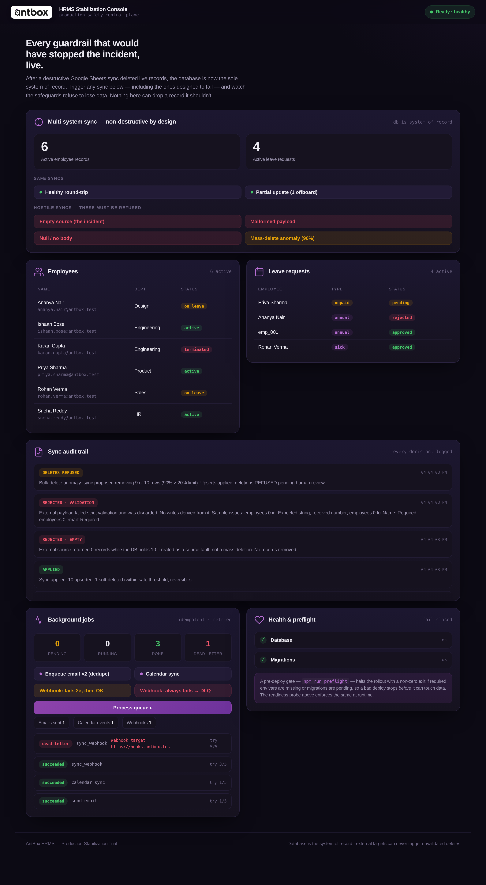

# AntBox HRMS — Production Stabilization

A mini Node.js / TypeScript background task executor built to fix the three
failure modes behind the HRMS production incident:

1. **A destructive external sync** — a Google Sheets integration deleted live
   database records.
2. **No background job queuing** — long-running side effects rode along with
   user-facing requests.
3. **Migration bypasses during deployment** — schema drift shipped to prod.

The guiding rule throughout: **the database is the system of record, and no
external SaaS can ever trigger an unvalidated delete.**

There's also a live dashboard (`/`) that makes every guardrail visible — you
can fire the exact hostile syncs that caused the incident and watch the system
refuse to lose data.



---

## Quick start

```bash
npm install
cp .env.example .env          # sensible local defaults
npm run preflight             # fail-closed pre-deploy gate (see below)
npm run migrate               # apply schema migrations
npm run seed                  # load sample employees + leave requests
npm run dev                   # start API + worker + dashboard (tsx watch)
# → open http://localhost:3000
```

Or the built path:

```bash
npm run build
npm run predeploy             # build + preflight; halts if unsafe
npm start
```

Run the tests:

```bash
npm test
```

> Requires Node 20 LTS or newer. `better-sqlite3` compiles a native addon on
> install; on most systems this is automatic.

---

## Architecture at a glance

```
src/
  config/        env contract (zod) + tiny .env loader
  db/            sqlite client, migrations (with pending-detection), seed
  domain/        Employee/LeaveRequest zod schemas + repository (system of record)
  sync/          ← module 01: non-destructive multi-system sync
    externalTarget.ts   mock Google Sheets/webhook (can return hostile data on demand)
    snapshot.ts         last-known-good snapshots
    syncService.ts      the four safety gates
  queue/         ← module 02: durable, idempotent, backoff-retrying job queue
    queue.ts            enqueue/claim/retry/dead-letter
    worker.ts           polling worker (keeps effects off the request path)
    handlers/           idempotent email / calendar / webhook handlers
  health/        ← module 03: liveness + readiness checks
  preflight/     ← module 03: fail-closed deploy gate
  server/        express app, routes, dashboard
public/          the branded live dashboard (vanilla, no build step)
scripts/         preflight CLI
tests/           vitest: sync, queue, validation, health, api
```

### Tech choices (and why)

| Choice | Reason |
| --- | --- |
| **Express** | Ubiquitous and readable — the point of this trial is the safety logic, not framework novelty. |
| **zod** | The *same* schema validates DB reads and external responses. Strict validation of external data is the first safety gate. |
| **better-sqlite3** | Zero-config, synchronous, runs anywhere with no Docker or Redis. A real relational store with transactions and constraints. Swap for Postgres by changing one module. |
| **In-process queue (hand-rolled)** | The brief evaluates whether idempotency and backoff are *understood*. BullMQ would hide exactly the logic under review. An in-process queue is explicitly acceptable and needs no Redis. |
| **vitest + supertest** | Fast, TS-native, and supertest drives the real HTTP surface. |

---

## Module 01 — Safe multi-system synchronization

`syncService.ts` reconciles data pulled from the external target into the DB.
It applies additive changes (upserts) freely, but treats **every deletion as
guilty until proven safe** through four independent gates:

1. **Usable body** — a `null`/absent response is rejected outright.
2. **Strict schema validation** — the payload must match the zod schema
   exactly (`.strict()`, so extra/missing keys or wrong types are refused). A
   third-party error page rendered as JSON never becomes a database write.
3. **Empty-source guard** — an empty payload while the DB is non-empty is the
   *exact incident signature*. "Source is genuinely empty" and "source
   glitched" are indistinguishable, so we **fail closed** and refuse the whole
   sync. This alone would have prevented the incident.
4. **Bulk-delete anomaly guard** — deletions above a threshold
   (`maxDeleteRatio`, default 20% of rows, above an absolute floor) are
   refused. The safe upserts still apply; the deletions are held for human
   review (`applied_upserts_only`).

Two more defence-in-depth details:

- **Soft deletes** (`deleted_at`) — even an *authorised* deletion is
  reversible, so no sync is ever a permanent data-loss event.
- **Audit trail** — every sync decision (outcome + reason + counts) is logged
  to `sync_audit`. That's the paper trail that was missing during the incident.

### Outcomes

| Outcome | Meaning |
| --- | --- |
| `applied` | Upserts and any in-threshold deletions applied; snapshot refreshed. |
| `applied_upserts_only` | Upserts applied; deletions refused by the anomaly guard. |
| `rejected_validation` | Payload failed strict validation; nothing written. |
| `rejected_empty` | Empty source over a non-empty DB; refused entirely. |
| `rejected_null` | No usable body. |

A refused sync is a **successful safety outcome**, so the API returns `200`
with the outcome in the body — not a `500`.

---

## Module 02 — Queued background execution & resilience

`queue.ts` is a small durable queue backed by SQLite:

- **Idempotent enqueue** — jobs carry an `idempotencyKey` with a UNIQUE
  constraint; enqueuing the same effect twice collapses to one job.
- **At-least-once execution, exactly-once effect** — handlers are written to
  be idempotent (keyed writes). A completed idempotency key short-circuits a
  re-run, so a crash *after* the side effect but *before* the status commit
  never double-sends.
- **Exponential backoff** — failures retry at `base · 2^(attempt-1)`, not in a
  tight loop.
- **Dead-lettering** — a job that exhausts `maxAttempts` moves to
  `dead_letter`. A poison job never blocks the rest of the queue.
- **Off the request path** — a polling `Worker` drains jobs, so emails,
  webhooks and calendar syncs never ride along with a user request.

---

## Module 03 — Pre-deployment & health controls

- **`GET /health/live`** — liveness. Cheap, no dependencies. A failure tells an
  orchestrator to *restart*.
- **`GET /health/ready`** — readiness. Verifies DB connectivity **and** that no
  migrations are pending. Returns `503` when degraded so a load balancer stops
  routing (but doesn't restart).
- **`npm run preflight`** — a **fail-closed** pre-deploy gate. Exits non-zero
  (halting the pipeline) if required env vars are missing/invalid or migrations
  are pending against the target DB — the direct fix for "migration bypasses
  during deployment". Wire it as `npm run predeploy && npm start`.

```
$ npm run preflight        # with pending migrations
  ✓  environment    All required variables present and valid.
  ✗  migrations     6 pending migration(s) would be bypassed: #1 create_employees, …
  RESULT: FAIL — deployment halted. Fix the above first.   (exit 1)
```

---

## Failure scenarios covered by tests

`npm test` — 33 tests across 5 files. The ones that matter most:

- **Empty source does not delete** — the incident, refused (`sync.test.ts`).
- **Malformed / null payloads** — refused with zero writes derived.
- **Mass-delete anomaly** — 90%-deletion sync applies upserts but refuses the
  deletes.
- **Deletions are reversible** — soft-delete leaves the record recoverable.
- **Enqueue dedupe**, **exponential backoff → eventual success**,
  **dead-lettering without blocking the queue**, and **crash-window
  short-circuit** (`queue.test.ts`).
- **Preflight fails closed** on missing env and on pending migrations
  (`health.test.ts`).
- **HTTP surface**: a hostile sync returns `200` + refused outcome, not a `500`
  (`api.test.ts`).

---

## The dashboard

`/` is a live, branded console (vanilla JS, polls `/api/state`). It exists to
make the guardrails tangible: trigger any sync — including the hostile ones —
and watch the record counts hold, the audit trail explain each decision, and
the job queue retry and dead-letter in real time. Motion follows a
pointer-down-first, spring-eased style; it respects `prefers-reduced-motion`.

The dashboard is a bonus over the brief's requirements — the graded system is
the backend and its tests.

---

## Trade-offs & what I'd do with more time

Honest about the boundaries of a trial-sized build:

- **In-process queue** — fine for one node; a multi-instance deploy needs
  `SELECT … FOR UPDATE SKIP LOCKED` on Postgres (or BullMQ/Redis) so two
  workers don't claim the same job. The `Queue` interface is deliberately
  small to make that swap contained.
- **Sync is pull-oriented and mock-targeted** — a real integration adds
  auth, pagination, rate limits, and a reconciliation cursor. The safety gates
  are the transferable part.
- **Bulk-delete threshold is a heuristic** — 20% is a sensible default; in
  production it'd be configurable per entity and paired with an alert +
  approval flow rather than a silent hold.
- **Observability** — I'd add structured logging (pino) and metrics
  (queue depth, retry rates, refused-sync counts) so the guardrails are
  monitorable, not just present.
- **Snapshot retention** — snapshots currently accumulate; they'd need pruning
  and, ideally, a one-command "restore last-known-good".
- **AuthN/Z** — out of scope here; the sync and job endpoints would sit behind
  service auth.

Any assumption I had to make is written down at the point it matters in the
code, per the brief.

---

## API reference

| Method | Path | Purpose |
| --- | --- | --- |
| `GET` | `/health/live` | Liveness. |
| `GET` | `/health/ready` | Readiness (503 when degraded). |
| `GET` | `/api/state` | Combined dashboard state. |
| `GET` | `/api/employees`, `/api/leave` | Current records. |
| `GET` | `/api/sync/audit` | Sync decision log. |
| `POST` | `/api/sync/pull` | Run a sync. Body: `{ "scenario": "healthy" \| "empty" \| "malformed" \| "null" \| "mass_delete" \| "partial_update" }`. |
| `POST` | `/api/sync/push` | Export DB → target (always non-destructive). |
| `GET` | `/api/jobs` | Jobs + counts + effect ledger. |
| `POST` | `/api/jobs/enqueue` | Enqueue a demo job. Body: `{ "type": "send_email" \| "calendar_sync" \| "sync_webhook", "failTimes"?: number }`. |
| `POST` | `/api/jobs/process` | Drain due jobs now (the worker also does this on a timer). |
